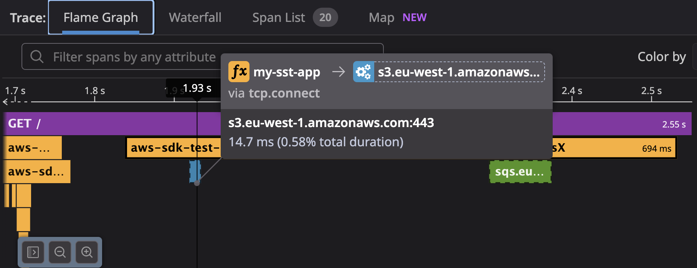
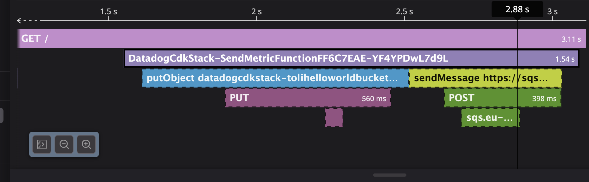

# Reproduction notes

1. `cd datadog-cdk && npm i`
2. `npm run build`
3. `npx cdk deploy`
4. `cd ..`
5. `cd my-sst-app && pnpm i`
6. `pnpm sst deploy --stage test`
7. Hit the two endpoints, e.g. `curl https://<your-api-id>.execute-api.eu-west-1.amazonaws.com/prod/` for CDK and `curl https://<your-api-id>.execute-api.eu-west-1.amazonaws.com` for SST

## What to expect

S3 and SQS spans should appear in the traces for both.

### SST

❌ No S3 and SQS spans are created.

### CDK

✅ Both S3 and SQS spans are created as expected.

