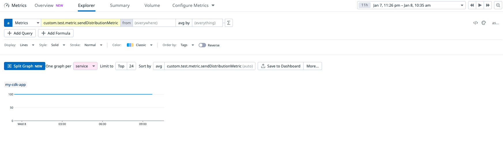

# Reproduction notes

1. `cd datadog-cdk`
2. `npm run build`
3. `npx cdk deploy`
4. `cd ..`
5. `cd my-sst-app`
6. `npm sst deploy -stage test`
7. Hit the two endpoints

Metrics should be sent to Datadog. Only the cdk app is sending metrics. The SST app is not.

