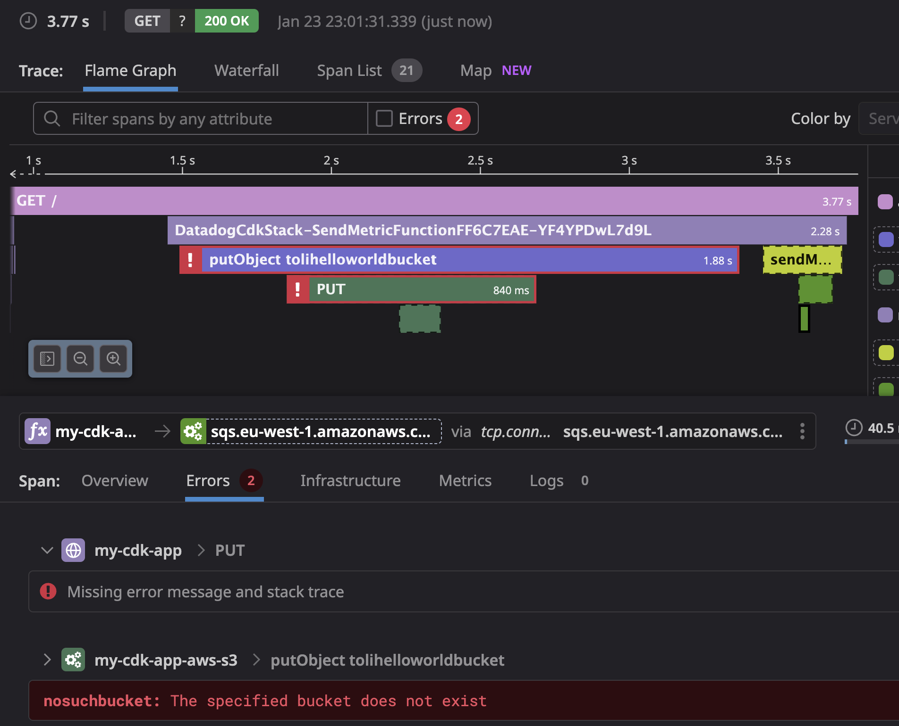
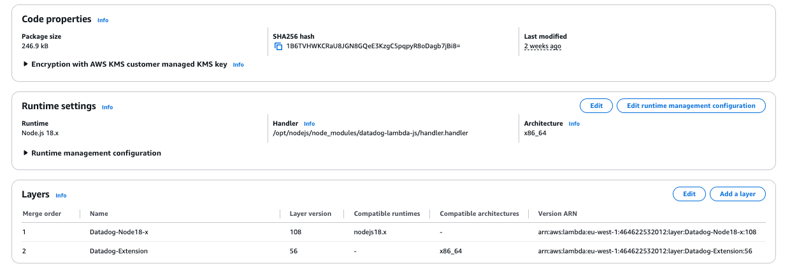
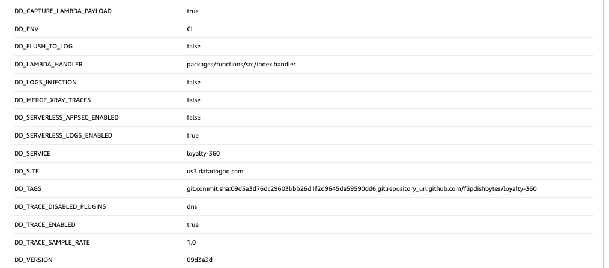
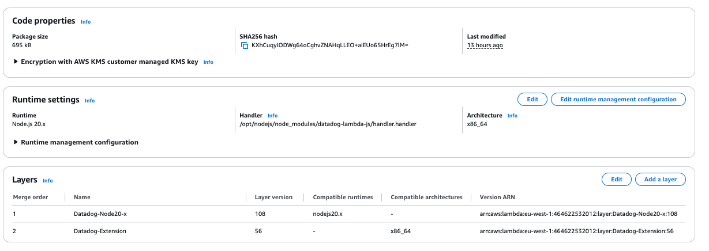
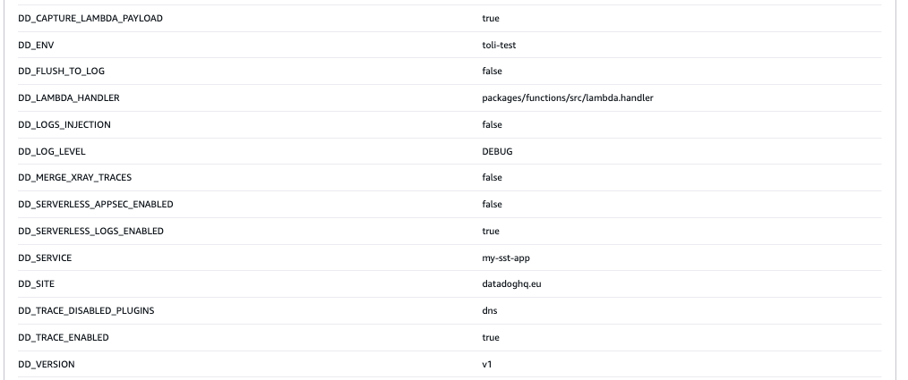
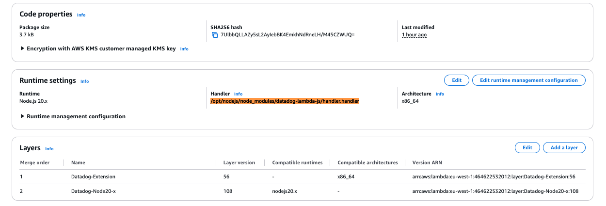

# Reproduction notes

1. `cd datadog-cdk && npm i`
2. `npm run build`
3. `npx cdk deploy`
4. `cd ..`
5. `cd my-sst-app && pnpm i`
6. `pnpm sst deploy --stage test`
7. Hit the two endpoints, e.g. `curl https://<your-api-id>.execute-api.eu-west-1.amazonaws.com/prod/` for CDK and `curl https://<your-api-id>.execute-api.eu-west-1.amazonaws.com` for SST

S3 and SQS spans should appear in the traces for both. Both the S3 and SQS spans should be created.

## Notes

We do have a stack in production that works using SST. Here's a representative example of the Lambda configuration:

For the SST stack in this repo, the Lambda configuration is the same, but the metrics are not sent to Datadog.

For the CDK stack in this repo, the Lambda configuration looks very similar, but the metrics are sent to Datadog.

The difference is how the Lambda is packaged and deployed.

Note how the handler in both cases is set to `/opt/nodejs/node_modules/datadog-lambda-js/handler.handler` and `DD_LAMBDA_HANDLER` is set to `sendMEtric.handler` in the CDK stack, but `DD_LAMBDA_HANDLER` is set to `lambda.handler` in the SST stack. This is correct. WE have also included the `datadog-lambda-js` package in both stacks. According to the documentation this means that we are using the packages rather than the layers? I'm not sure if that's true.

There is documentation [here](https://docs.datadoghq.com/serverless/guide/serverless_tracing_and_bundlers/#aws-cdk--esbuild) that suggesets how to confiugre `esbuild` but this is not implemented in this repo (nor have I tried it).
