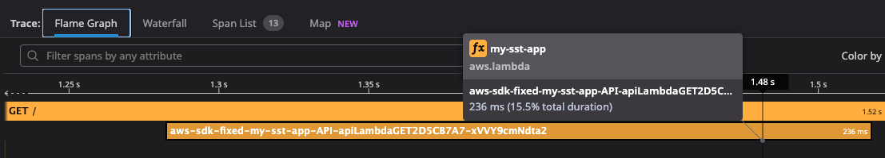

# Reproduction notes

1. `cd datadog-cdk && npm i`
2. `npm run build`
3. `npx cdk deploy`
4. `cd ..`
5. `cd my-sst-app && pnpm i`
6. `pnpm sst deploy --stage test`
7. Hit the two endpoints, e.g. `curl https://<your-api-id>.execute-api.eu-west-1.amazonaws.com/prod/` for CDK and `curl https://<your-api-id>.execute-api.eu-west-1.amazonaws.com` for SST

## What to expect

S3 and SQS spans should appear in the traces for both.

### SST

❌ No S3 and SQS spans are created.

#### Resolution

Thanks to Datadog support, the issue was resolved. The problem was 2-fold:

1. We werent' *actually* excluding the libraries from the build, e.g. `dd-trace` and `datadog-lambda-js`.
2. We weren't excluding the `@aws-sdk/client-s3` and `@aws-sdk/client-sqs` libraries from the build.

The `setDefaultFunctionProps` function can be called both at the app level and the stack level. If you call it at the stack level, it will override the app level setting. So when we were marking the packages as external, we were doing it at the app level, but the stack level setting was overriding it with no packages set to `external` as all it was doing related to `nodejs` was setting the `sourcemap` to `true`.

So, we get a trace with no spans related to S3 and SQS.

Let's try it again.

1. Remove any references to setting for `nodejs` in the `sst.config.ts` file.
2. Add the `nodejs` setting to the `MyStack.ts` file. This includes the `esbuild` configuration that marks packages as external.

S3 and SQS spans are now created as expected.

### CDK

✅ Both S3 and SQS spans are created as expected.

